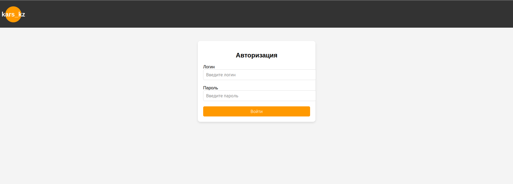
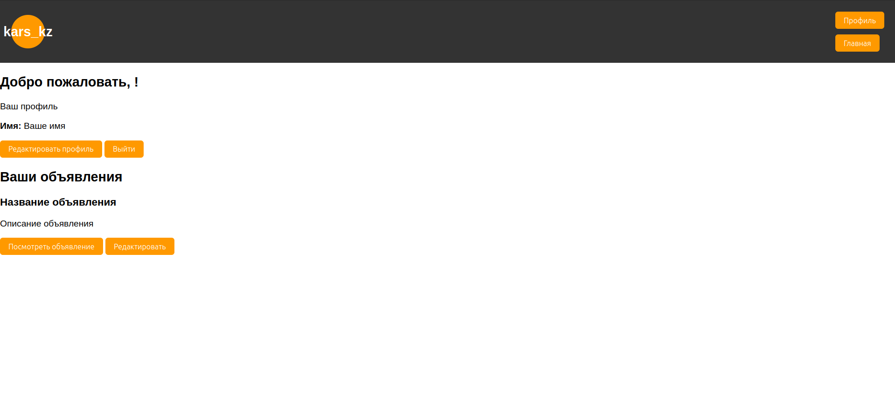

# Проект "Регистрация и Авторизация"

Это проект для регистрации и авторизации пользователей. Он использует Flask для веб-сервера и SQLite для хранения данных пользователей. Пользователи могут зарегистрироваться, войти в систему и получить доступ к личным данным.

## Описание

Проект представляет собой веб-приложение с функционалом регистрации и авторизации пользователей. Веб-приложение написано на Python с использованием фреймворка Flask и базы данных SQLite. Пользователи могут:

- Регистироваться с указанием логина, пароля и почты.
- Авторизовываться, вводя логин и пароль.
- После успешной авторизации они перенаправляются на домашнюю страницу.

## Скриншоты

Вот как выглядит страница регистрации:


А вот пример страницы авторизации:




А вот пример страницы профиля:




## My face when i see you have ask me a stupid question


## Как установить и запустить

1. Клонируйте репозиторий:

   ```bash
   git clone https://github.com/IceMelisa/kars_kz.git
